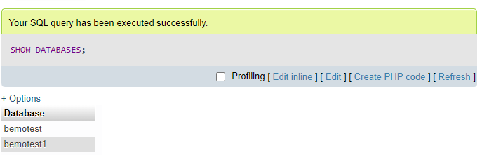

This is a SQL tutorial which is based on Sumit Sir youtube playlist. I think this will be very helpful who wants to learn SQL genuinely and effective way.

## Getting started with SQL - Session 1
### What is database?
- a collection of data and holds this data in the form of tables.
### what is table?
- holds the data in form of rows and columns.

The database provides us the capability to access and manipulate this data.

There are two types of database. These are:
1. Relational Database
2. NoSQL Database

### Relational Database
----------------------
- consists of rows & columns
- have relations between tables
- examples are MySQL, SQL Server, PostgreSQL, SQLite, MariaDB, etc.

### NoSQL Database
----------------------
- consists of key, value pair or document basis or graph basis or etc.
- no tables.
- examples are Hbase, MongoDB, Cassandra, etc.
- each database has own language to interact with NoSQL database.

### What is SQL?
- stands for Structured Query Language and is used to query a relational database.
- deals with Structured data which is formed with the combination of rows & columns.
- a way to interact with the databases such as MySQL, SQL Server, PostgreSQL, SQLite, MariaDB, etc.

## SQL vs Different Databases (MySQL, SQL Server, PostgreSQL, SQLite, MariaDB, etc.)
- By SQL you can interact, modified, update with different databases.
- Different databases provide different features & security. If you know SQL you will be able to interact or communicate with all kinds of relational databases.

Practice SQL query with MySQL Database:

* SHOW DATABASES;
- this command gives you list of databases which are already present.

