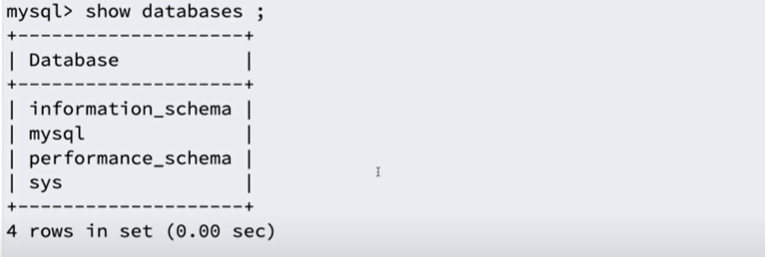
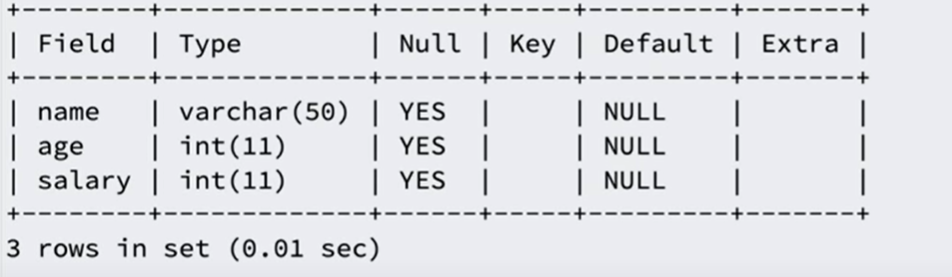
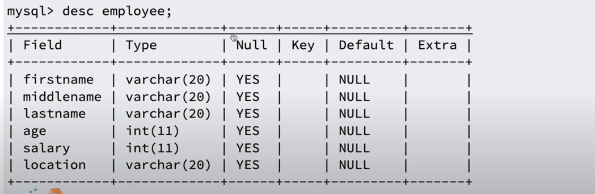
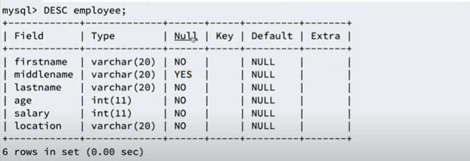
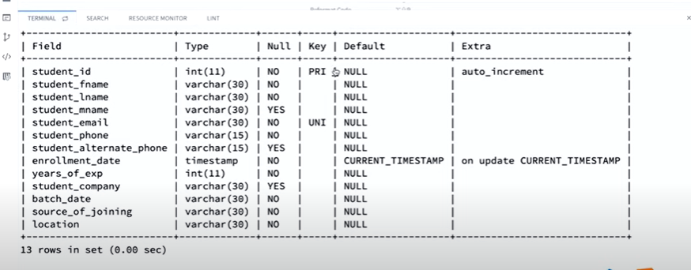
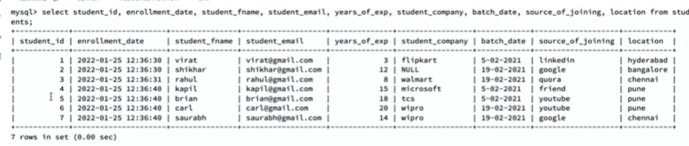
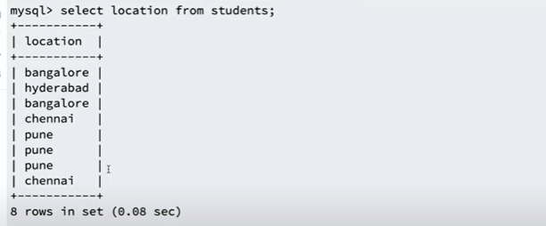
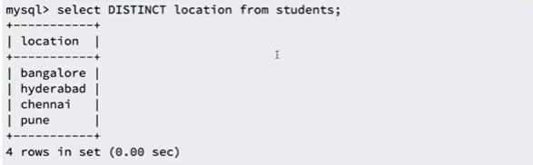

This is a SQL tutorial which is based on Sumit Sir youtube playlist. I think this will be very helpful who wants to learn SQL genuinely and effective way.

[1. Getting started with SQL - Session 1](#getting-started-with-sql-session-1)

[2. Learn SQL the right way - Session 2](#learn-sql-the-right-way-session-2)

[3. Learn SQL the right way - Session 3](#learn-sql-the-right-way-session-3)

[4. Learn SQL the right way - Session 4](#learn-sql-the-right-way-session-4)

# Getting started with SQL: Session 1
### What is database?
- a collection of data and holds this data in the form of tables.
### what is table?
- holds the data in form of rows and columns.

The database provides us the capability to access and manipulate this data.

There are two types of database. These are:
1. Relational Database
2. NoSQL Database

### Relational Database
----------------------
- consists of rows & columns
- have relations between tables
- examples are MySQL, SQL Server, PostgreSQL, SQLite, MariaDB, etc.

### NoSQL Database
----------------------
- consists of key, value pair or document basis or graph basis or etc.
- no relation between tables.
- examples are Hbase, MongoDB, Cassandra, etc.
- each database has own language to interact with NoSQL database.

### What is SQL?
- stands for Structured Query Language and is used to query a relational database.
- deals with Structured data which is formed with the combination of rows & columns.
- a way to interact with the databases such as MySQL, SQL Server, PostgreSQL, SQLite, MariaDB, etc.

### SQL vs Different Databases (MySQL, SQL Server, PostgreSQL, SQLite, MariaDB, etc.)
- By SQL you can interact, modified, update with different databases.
- Different databases provide different features & security. If you know SQL you will be able to interact or communicate with all kinds of relational databases.

Practice SQL query with MySQL Database:

`SHOW DATABASES;`
- this command gives you list of databases which are already present.
)

`CREATE DATABASE trendytech;`
- by this command you can create a new database, here database name `trendytech`.

`DROP DATABASE trendytech`
- by this command you can delete specific database, here I deleted `trendytech` database.

`USE trendytech;`
- by this command you will connect with certain database, here I used `trendytech` database.

`SELECT DATABASE();`
- by this command you will know in which database you are connected.

```
CREATE TABLE employee
(
  name VARCHAR(50),
  age INT,
  salary INT
);
```
- this command creates a new table inside a connected database. Here, table name is `employee` and database name is `trendytech`.
- `VARCHAR` and `INT` are two datatypes from many datatypes. `VARCHAR` is used for `string` and `INT` is used for `numeric`.

`SHOW TABLES;`
- this command is used for list of tables of connected database.

`DESCRIBE employee;` or `DESC employee;`
- this command is used for describing or showing a table structure.


`DROP TABLE employee`
- this command will delete `employee` table.

**If you drop connected database and want to create a table, you will get a error because you are not connected to any database. This is expected becuse you should be connected to any database to create tables.**

**If you are not connected to any database and want to create tables you have to explicitely defined database name like below example.**

```
CREATE TABLE trendytech.employee
(
  name VARCHAR(50),
  age INT,
  salary INT
);
```
- here `trendytech` is database name and `employee` is table name.

# Learn SQL the right way: Session 2

**CRUD - Operations**
```Learn SQL the right way - Session 2
create - insert statements
read - select statements
create - update statements
create - delete statements

```

Let's start with fresh `employee` table by deleting previous one. Create `employee` table by this command.

```
CREATE TABLE employee
(
  firstname VARCHAR(20),
  middlename VARCHAR(20),
  lastname VARCHAR(20),
  age INT,
  salary INT,
  location VARCHAR(20)
);
```
To see the structure of this table. Please give below command.
`DESC employee;`


`SELECT * FROM employee;`
- this command is used for to show all data from `employee` table.
- here `*` means all data

Now, we want to insert some data inside this `employee` table. Let's use this command.

`INSERT INTO employee VALUES ('kapil', 'kumar', 'sharma', 30, 30000, 'bangalore');`
- by this command you can insert data.
But it is recommended. Recommended approach is always mention column name after table name. Otherwise, you will get error if column count and value does not match.

`INSERT INTO employee(firstname, middlename, lastname, age, salary, location) VALUES ('kapil', 'kumar', 'sharma', 30, 30000, 'bangalore');`

If you want to skip one column then you can give like this command.

`INSERT INTO employee(firstname, lastname, age, salary, location) VALUES ('rajesh', 'sharma', 32 , 30000, 'bangalore');`
- here `middlename` column we have skipped and so `middlename` value will be `NULL`.
- `NULL` value basically `undefined`.

If you skip any column then you should mention column name, otherwise you have to insert all column data. Look at this command:

`INSERT INTO employee VALUES ('rajesh', 'sharma', 32 , 30000, 'bangalore');`
- you will get error (column count doesn't match value count) because you skip `middlename` column but you don't mention column name.

If you want to insert value with single quote or double quote you have to give wrap quote with another quote. Or, you can use escape(\) character.
```
"rajesh's" or 'rajesh"s' or 'rajesh\'s'
```

For inserting multiple values you can give below command.
`INSERT INTO employee(firstname, lastname, age, salary, location) VALUES ('rajesh', 'sharma', 32 , 30000, 'bangalore'), ('rakesh', 'bala', 40 , 90000, 'bangalore') ;`

If you insert wrong data type like, here `age` is `integer` data tpe if you give `string` data type you will get error.

If you insert more character than you defined then you will also get error like, here if `firstname` column is defined `varchar(20)` and if you entered more than 20 character you will also get error.

`NULL`
- is a specially value which is unknown or undefined.
  
If you want to restrict one column that cannot be `NULL` then we have to mention `NOT NULL` property when we will create or declare a table like this.

```
CREATE TABLE employee
(
  firstname VARCHAR(20) NOT NULL,
  middlename VARCHAR(20),
  lastname VARCHAR(20) NOT NULL,
  age INT NOT NULL,
  salary INT NOT NULL,
  location VARCHAR(20) NOT NULL
);
```
- here, you can insert only `middlename` column `NULL` but other columns must inclue value you cannot set empty or `NULL` value.

We can see the structure of this table by entering `DESC employee` command.



**DEFAULT VALUES**
If you want to give `DEFAULT`value of one column you have to give default value when we will create or declare a table like this.

```
CREATE TABLE employee
(
  firstname VARCHAR(20) NOT NULL,
  middlename VARCHAR(20),
  lastname VARCHAR(20) NOT NULL,
  age INT NOT NULL,
  salary INT NOT NULL,
  location VARCHAR(20) DEFAULT 'bangalore'
);
```
- here, if you do not insert location value, it automatically insert `bangalore` as a location value.

We can manually insert value as a `NULL` for a default value column like this.
`INSERT INTO employee(firstname, lastname, age, salary, location) VALUES ('rakesh', 'sharma', 40 , 90000, NULL) ;`
- here, we explicitly set `location` value as a `NULL`. 

# Learn SQL the right way: Session 3

Agenda:
PRIMARY KEY
AUTO INCREMENT KEYS
UNIQUE KEY
PRIMARY KEYS vs UNIQUE KEYS

**PRIMARY KEY:**
- used for uniquely identify a row from database.
- cannot be `NULL`.
- does not allows duplicates value.
- you can have only one primary key.

By below structure `PRIMARY KEY` can be defined 

 ```
CREATE TABLE employee
(
  id INT PRIMARY KEY,
  firstname VARCHAR(20) NOT NULL,
  middlename VARCHAR(20),
  lastname VARCHAR(20) NOT NULL,
  age INT NOT NULL,
  salary INT NOT NULL,
  location VARCHAR(20) NOT NULL DEFAULT 'bangalore'
);

OR

CREATE TABLE employee
(
  id INT,
  firstname VARCHAR(20) NOT NULL,
  middlename VARCHAR(20),
  lastname VARCHAR(20) NOT NULL,
  age INT NOT NULL,
  salary INT NOT NULL,
  location VARCHAR(20) NOT NULL DEFAULT 'bangalore',
  PRIMARY KEY(id)
);

```
- here `id` column is a primary key

Sometimes `PRIMARY KEY` can be created by the combination of two columns.

**AUTO INCREMENT**
- this command automatically increment value
- very good candidate for `PRIMARY KEY`
- prevent duplication since it automatically increment values.

By below structure `AUTO INCREMENT` can be defined 

 ```
CREATE TABLE employee
(
  id INT PRIMARY KEY AUTO_INCREMENT,
  firstname VARCHAR(20) NOT NULL,
  middlename VARCHAR(20),
  lastname VARCHAR(20) NOT NULL,
  age INT NOT NULL,
  salary INT NOT NULL,
  location VARCHAR(20) DEFAULT 'bangalore'
);
```

**UNIQUE KEY**
- cannot hold duplicate values like primary key.
- but, unique key can hold `NULL` value.
- purpose of unique key is to make sure the values do not duplicate.
- `UNIQUE KEY` also can be defined combination of two columns as like as `PRIMARY KEY`.
- more than one column can be defined as a `UNIQUE KEY` where there is only one `PRIMARY KEY` in a table but it can be constitue by the combination of two columns.

How many `NULL` values can hold `UNIQUE KEY`?
- it depends on database.
- for example, in MySQL an unique key can hold any number of NULL values but some of other databases it holds only one NULL values.

By below structure `UNIQUE KEY` can be defined 
 ```
CREATE TABLE employee
(
  id INT PRIMARY KEY AUTO_INCREMENT,
  firstname VARCHAR(20) NOT NULL,
  middlename VARCHAR(20),
  lastname VARCHAR(20) NOT NULL,
  email VARCHAR(30) UNIQUE KEY,
  phone VARCHAR(30) UNIQUE KEY,
  age INT NOT NULL,
  salary INT NOT NULL,
  location VARCHAR(20) DEFAULT 'bangalore'
);
```


# Learn SQL the right way: Session 4

UPDATE

DELETE

DDL VS DML

TRUNCATE VS DELETE

CRUD Operations
---------------------------------------
CREATE - INSERT
READ - SELECT
UPDATE - UPDATE
DELETE - DELETE

If you want to read all columns then if you have to give below command.

`SELECT * FROM employee;`
- here, `*` means getting all columns from `employee` table.

If you want to get specific column you have to specify column name like this.
`SELECT firstname, lastname FROM employee`
- by this command you will get only firstname and lastname column from `employee` name.

**WHERE CLAUSE**
- `WHERE` clause is used for filtering `rows` based on condition.

For instace, if you want to see the employee list whose employee age is greater than 20, then you have to give this below command.

`SELECT * FROM employee WHERE age > 20;`
- It will give the employee list whose age is greater than 20.

Another example is:

`SELECT * FROM employee WHERE firstname='maneesh'`
- It will give the employee list whose firstname is `maneesh`;

By default it is case insensitive. Since you have given firstname as `maneesh` you can get firstname `Maneesh` also.

If you want to do it will be case sensitive then you have to add `binary` keyword after `WHERE` clause like this.

`SELECT * FROM employee WHERE binary firstname='maneesh'`
- now, you will get only such whose firstname is exactly `maneesh`.

**ALIAS**
- when we want to get column name as a different name we have to use `AS` keyword and it is called `ALIAS`.

See this example:
`SELECT firstname as name, lastname as surname FROM employee;`
- it will show two column with `name` and `surname` respectively.


**UPDATE**

We can give update query below like this:

`UPDATE employee SET lastname="sinha" WHERE firstname="Maneesh";`
- it  will update lastname as `sinha` where firstname is `Maneesh`.
- By `WHERE` condition we can update specific column.


**DELETE**
We can give delete query below like this:

`DELETE FROM employee WHERE id=1;`
- By this command you will be able to delete data where id=2.

-`DELETE FROM employee`.
- it will delete all the data from `employee` table.

**You have to be very careful when you will deal with `UPDATE` and `DELETE` command.**

**ALTER**
- deals with structure of the table, basically it updates the structure of the table.

We can give alter command below like this:

`ALTER TABLE employee ADD COLUMN jobtitle VARCHAR(50);`
- this command will add a new column name `jobtitle` in employee table whose datatype will be will be `VARCHAR(50)`.

`ALTER TABLE employee DROP COLUMN jobtitle VARCHAR(50);`
- by this command we can delete column from `employee` table.

`ALTER TABLE employee MODIFY COLUMN firstname VARCHAR(50);`
- by this command it will modify firstname column data size to VARCHAR(50).

`ALTER TABLE employee DROP PRIMARY KEY;`
- it will drop primary key.


**DDL**
- Data Definitaion Language
- deals with table structure
- they do not manimulate the data
- `CREATE`, `ALTER`, `DROP` - DDL Commands

**DML**
- Data Manipulation Language
- deals with data directly
- do not modify table structure
- `INSERT`, `UPDATE`, `DELETE` - DML Commands

**TRUNCATE**

- it will drop table firstly, then recreate table again.
- it is a `DDL` commands.
- efficient when you want to delete all data from a table.

**TRUNCATE vs DELETE**
- `TRUNCATE` is a `DDL` command and `DELETE` is a DML command.
- `DELETE` command delete data from table one by one, that's why it is slow operation whereas `TRUNCATE` delete the whole table and recreate table again.

# Foreign key constraint: Session 5

**A `Foreign Key` is a field in one table that refers to the primary key in another table.** 

The table with the `foreign key` is called the child table, the table with `primary key` is called the parent table.

 Suppose, there is no table in database. We will create a `students` table in `trendytech` database like this.

 ```
 CREATE TABLE students (
  student_id INT PRIMARY KEY AUTO_INCREMENT,
  student_fname VARCHAR(30) NOT NULL,
  student_mname VARCHAR(30),
  student_lname VARCHAR(30) NOT NULL,
  student_email VARCHAR(30) NOT NULL UNIQUE KEY,
  student_phone VARCHAR(15) NOT NULL,
  enrollment_date TIMESTAMP NOT NULL,
  years_of_exp INT NOT NULL,
  student_company VARCHAR(30),
  batch_date VARCHAR(30) NOT NULL,
  source_of_joining VARCHAR(30) NOT NULL,
  location VARCHAR(30) NOT NULL
 );

 ```
We can see this table structure by this command:

`DESC students;`



Insert some data in `students` table by like this.

```
INSERT INTO students(student_fname, student_lname, student_email, student_phone, years_of_exp, student_company, batch_date, source_of_joining, location) VALUES('virat', 'kohli', 'virat@gmail.com', '9292929292', 3, 'flipkart', '5-02-2021', 'linkedin', 'hyderabad');

```
After inserting some data it will be like this:


This table is good for single course. If there are multiple courses we have to introduce a new `courses` table.

```
CREATE TABLE courses (
  course_id INT NOT NULL PRIMARY KEY AUTO_INCREMENT,
  course_name VARCHAR(30) NOT NULL,
  course_duration_months INT NOT NULL,
  course_fee INT NOT NULL
); 
```
Insert some course data by running below command:

```
INSERT INTO courses(course_name, course_duration_months, course_fee) VALUES(1, 'big data', 6, 5000);
```

Now we have to relation `students` table with `courses` table. We can update `students` by adding a `FOREIGN KEY` in `students` table like this.

 ```
 CREATE TABLE students (
  student_id INT PRIMARY KEY AUTO_INCREMENT,
  student_fname VARCHAR(30) NOT NULL,
  student_mname VARCHAR(30),
  student_lname VARCHAR(30) NOT NULL,
  student_email VARCHAR(30) NOT NULL UNIQUE KEY,
  student_phone VARCHAR(15) NOT NULL,
  enrollment_date TIMESTAMP NOT NULL,
  selected_course INT NOT NULL DEFAULT 1,
  years_of_exp INT NOT NULL,
  student_company VARCHAR(30),
  batch_date VARCHAR(30) NOT NULL,
  source_of_joining VARCHAR(30) NOT NULL,
  location VARCHAR(30) NOT NULL,
  FOREIGN KEY(selected_course) REFERENCES courses(course_id )
 );

 ``` 

 - here, parent table is `courses` table and child table is `students` table.
 - you cannot enter data in `selected_course` field which is not present in `courses` table in `course_id` field.

You cannot also `delete` course from `courses` table which `id` is related with `students` table because of `FOREIGN KEY` constrait.

What is constraints?

Constraints are used to limit the type of data that can go into a table.
- This ensures the accuracy and reliability of the data is maintained. 
- If there is any violation then the action is aborted.

Some constraints:

```
NOT NULL
UNIQUE KEY
PRIMARY KEY
FOREIGN KEY
CHECK CONSTRAINT (not supported in mysql)

```

# Distinct, Order By, Limit, Like Keyword: Session 6

Agenda:
DISTINCT
ORDER BY
LIMIT
LIKE

**DISTINCT**
 - remove redundancy & duplicate data.

Suppose we want to see `location` from `students` table. We can give below command.

`SELECT location FROM students;`

It will give redundant data like this.



But if we give command like this, we will get duplicate free data.

`SELECT DISTINCT location FROM students;`



