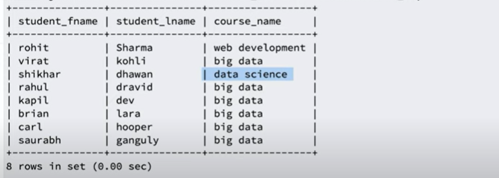

This is a SQL tutorial which is based on Sumit Sir youtube playlist. I think this will be very helpful who wants to learn SQL genuinely and effective way.

[1. Getting started with SQL - Session 1](#getting-started-with-sql-session-1)

[2. Learn SQL the right way - Session 2](#learn-sql-the-right-way-session-2)

[3. Learn SQL the right way - Session 3](#learn-sql-the-right-way-session-3)

[4. Learn SQL the right way - Session 4](#learn-sql-the-right-way-session-4)

[5. Foreign key constraint - Session 5](#foreign-key-constraint-session-5)

[6. Distinct, Order By, Limit, Like Keyword: Session 6](#distinct-order-by-limit-like-keyword-session-6)

[7. Order of execution in SQL: Session 7](#order-of-execution-in-SQL-session-7)

# Getting started with SQL: Session 1

### What is database?
- a collection of data and holds this data in the form of tables.
### what is table?
- holds the data in form of rows and columns.

The database provides us the capability to access and manipulate this data.

There are two types of database. These are:
1. Relational Database
2. NoSQL Database

### Relational Database
----------------------
- consists of rows & columns
- have relations between tables
- examples are MySQL, SQL Server, PostgreSQL, SQLite, MariaDB, etc.

### NoSQL Database
----------------------
- consists of key, value pair or document basis or graph basis or etc.
- no relation between tables.
- examples are Hbase, MongoDB, Cassandra, etc.
- each database has own language to interact with NoSQL database.

### What is SQL?
- stands for Structured Query Language and is used to query a relational database.
- deals with Structured data which is formed with the combination of rows & columns.
- a way to interact with the databases such as MySQL, SQL Server, PostgreSQL, SQLite, MariaDB, etc.

### SQL vs Different Databases (MySQL, SQL Server, PostgreSQL, SQLite, MariaDB, etc.)
- By SQL you can interact, modified, update with different databases.
- Different databases provide different features & security. If you know SQL you will be able to interact or communicate with all kinds of relational databases.

Practice SQL query with MySQL Database:

`SHOW DATABASES;`
- this command gives you list of databases which are already present.
)

`CREATE DATABASE trendytech;`
- by this command you can create a new database, here database name `trendytech`.

`DROP DATABASE trendytech`
- by this command you can delete specific database, here I deleted `trendytech` database.

`USE trendytech;`
- by this command you will connect with certain database, here I used `trendytech` database.

`SELECT DATABASE();`
- by this command you will know in which database you are connected.

```
CREATE TABLE employee
(
  name VARCHAR(50),
  age INT,
  salary INT
);
```
- this command creates a new table inside a connected database. Here, table name is `employee` and database name is `trendytech`.
- `VARCHAR` and `INT` are two datatypes from many datatypes. `VARCHAR` is used for `string` and `INT` is used for `numeric`.

`SHOW TABLES;`
- this command is used for list of tables of connected database.

`DESCRIBE employee;` or `DESC employee;`
- this command is used for describing or showing a table structure.


`DROP TABLE employee`
- this command will delete `employee` table.

**If you drop connected database and want to create a table, you will get a error because you are not connected to any database. This is expected becuse you should be connected to any database to create tables.**

**If you are not connected to any database and want to create tables you have to explicitely defined database name like below example.**

```
CREATE TABLE trendytech.employee
(
  name VARCHAR(50),
  age INT,
  salary INT
);
```
- here `trendytech` is database name and `employee` is table name.

# Learn SQL the right way: Session 2

**CRUD - Operations**
```Learn SQL the right way - Session 2
create - insert statements
read - select statements
update - update statements
delete - delete statements

```

Let's start with fresh `employee` table by deleting previous one. Create `employee` table by this command.

```
CREATE TABLE employee
(
  firstname VARCHAR(20),
  middlename VARCHAR(20),
  lastname VARCHAR(20),
  age INT,
  salary INT,
  location VARCHAR(20)
);
```
To see the structure of this table. Please give below command.
`DESC employee;`


`SELECT * FROM employee;`
- this command is used for to show all data from `employee` table.
- here `*` means all data

Now, we want to insert some data inside this `employee` table. Let's use this command.

`INSERT INTO employee VALUES ('kapil', 'kumar', 'sharma', 30, 30000, 'bangalore');`
- by this command you can insert data.
But it is recommended. Recommended approach is always mention column name after table name. Otherwise, you will get error if column count and value does not match.

`INSERT INTO employee(firstname, middlename, lastname, age, salary, location) VALUES ('kapil', 'kumar', 'sharma', 30, 30000, 'bangalore');`

If you want to skip one column then you can give like this command.

`INSERT INTO employee(firstname, lastname, age, salary, location) VALUES ('rajesh', 'sharma', 32 , 30000, 'bangalore');`
- here `middlename` column we have skipped and so `middlename` value will be `NULL`.
- `NULL` value basically `undefined`.

If you skip any column then you should mention column name, otherwise you have to insert all column data. Look at this command:

`INSERT INTO employee VALUES ('rajesh', 'sharma', 32 , 30000, 'bangalore');`
- you will get error (column count doesn't match value count) because you skip `middlename` column but you don't mention column name.

If you want to insert value with single quote or double quote you have to give wrap quote with another quote. Or, you can use escape(\) character.
```
"rajesh's" or 'rajesh"s' or 'rajesh\'s'
```

For inserting multiple values you can give below command.
`INSERT INTO employee(firstname, lastname, age, salary, location) VALUES ('rajesh', 'sharma', 32 , 30000, 'bangalore'), ('rakesh', 'bala', 40 , 90000, 'bangalore') ;`

If you insert wrong data type like, here `age` is `integer` data tpe if you give `string` data type you will get error.

If you insert more character than you defined then you will also get error like, here if `firstname` column is defined `varchar(20)` and if you entered more than 20 character you will also get error.

`NULL`
- is a specially value which is unknown or undefined.
  
If you want to restrict one column that cannot be `NULL` then we have to mention `NOT NULL` property when we will create or declare a table like this.

```
CREATE TABLE employee
(
  firstname VARCHAR(20) NOT NULL,
  middlename VARCHAR(20),
  lastname VARCHAR(20) NOT NULL,
  age INT NOT NULL,
  salary INT NOT NULL,
  location VARCHAR(20) NOT NULL
);
```
- here, you can insert only `middlename` column `NULL` but other columns must inclue value you cannot set empty or `NULL` value.

We can see the structure of this table by entering `DESC employee` command.


**DEFAULT VALUES**
If you want to give `DEFAULT`value of one column you have to give default value when we will create or declare a table like this.

```
CREATE TABLE employee
(
  firstname VARCHAR(20) NOT NULL,
  middlename VARCHAR(20),
  lastname VARCHAR(20) NOT NULL,
  age INT NOT NULL,
  salary INT NOT NULL,
  location VARCHAR(20) DEFAULT 'bangalore'
);
```
- here, if you do not insert location value, it automatically insert `bangalore` as a location value.

We can manually insert value as a `NULL` for a default value column like this.
`INSERT INTO employee(firstname, lastname, age, salary, location) VALUES ('rakesh', 'sharma', 40 , 90000, NULL) ;`
- here, we explicitly set `location` value as a `NULL`. 

# Learn SQL the right way: Session 3

Agenda:

```
PRIMARY KEY
AUTO INCREMENT KEYS
UNIQUE KEY
PRIMARY KEYS vs UNIQUE KEYS
```

**PRIMARY KEY:**
- used for uniquely identify a row from database.
- cannot be `NULL`.
- does not allows duplicates value.
- you can have only one primary key.

By below structure `PRIMARY KEY` can be defined 

 ```
CREATE TABLE employee
(
  id INT PRIMARY KEY,
  firstname VARCHAR(20) NOT NULL,
  middlename VARCHAR(20),
  lastname VARCHAR(20) NOT NULL,
  age INT NOT NULL,
  salary INT NOT NULL,
  location VARCHAR(20) NOT NULL DEFAULT 'bangalore'
);

OR

CREATE TABLE employee
(
  id INT,
  firstname VARCHAR(20) NOT NULL,
  middlename VARCHAR(20),
  lastname VARCHAR(20) NOT NULL,
  age INT NOT NULL,
  salary INT NOT NULL,
  location VARCHAR(20) NOT NULL DEFAULT 'bangalore',
  PRIMARY KEY(id)
);

```
- here `id` column is a primary key

Sometimes `PRIMARY KEY` can be created by the combination of two columns.

**AUTO INCREMENT**
- this command automatically increment value
- very good candidate for `PRIMARY KEY`
- prevent duplication since it automatically increment values.

By below structure `AUTO INCREMENT` can be defined 

 ```
CREATE TABLE employee
(
  id INT PRIMARY KEY AUTO_INCREMENT,
  firstname VARCHAR(20) NOT NULL,
  middlename VARCHAR(20),
  lastname VARCHAR(20) NOT NULL,
  age INT NOT NULL,
  salary INT NOT NULL,
  location VARCHAR(20) DEFAULT 'bangalore'
);
```

**UNIQUE KEY**
- cannot hold duplicate values like primary key.
- but, unique key can hold `NULL` value.
- purpose of unique key is to make sure the values do not duplicate.
- `UNIQUE KEY` also can be defined combination of two columns as like as `PRIMARY KEY`.
- more than one column can be defined as a `UNIQUE KEY` where there is only one `PRIMARY KEY` in a table but it can be constitue by the combination of two columns.

How many `NULL` values can hold `UNIQUE KEY`?
- it depends on database.
- for example, in MySQL an unique key can hold any number of NULL values but some of other databases it holds only one NULL values.

By below structure `UNIQUE KEY` can be defined 
 ```
CREATE TABLE employee
(
  id INT PRIMARY KEY AUTO_INCREMENT,
  firstname VARCHAR(20) NOT NULL,
  middlename VARCHAR(20),
  lastname VARCHAR(20) NOT NULL,
  email VARCHAR(30) UNIQUE KEY,
  phone VARCHAR(30) UNIQUE KEY,
  age INT NOT NULL,
  salary INT NOT NULL,
  location VARCHAR(20) DEFAULT 'bangalore'
);
```


# Learn SQL the right way: Session 4

UPDATE

DELETE

DDL VS DML

TRUNCATE VS DELETE

CRUD Operations
---------------------------------------

```
CREATE - INSERT
READ - SELECT
UPDATE - UPDATE
DELETE - DELETE
```

If you want to read all columns then if you have to give below command.

`SELECT * FROM employee;`
- here, `*` means getting all columns from `employee` table.

If you want to get specific column you have to specify column name like this.
`SELECT firstname, lastname FROM employee`
- by this command you will get only firstname and lastname column from `employee` table.

**WHERE CLAUSE**
- `WHERE` clause is used for filtering `rows` based on condition.

For instace, if you want to see the employee list whose employee age is greater than 20, then you have to give this below command.

`SELECT * FROM employee WHERE age > 20;`
- It will give the employee list whose age is greater than 20.

Another example is:

`SELECT * FROM employee WHERE firstname='maneesh'`
- It will give the employee list whose firstname is `maneesh`;

By default it is case insensitive. Since you have given firstname as `maneesh` you can get firstname `Maneesh` also.

If you want to do it will be case sensitive then you have to add `binary` keyword after `WHERE` clause like this.

`SELECT * FROM employee WHERE binary firstname='maneesh'`
- now, you will get only such whose firstname is exactly `maneesh`.

**ALIAS**
- when we want to get column name as a different name we have to use `AS` keyword and it is called `ALIAS`.

See this example:
`SELECT firstname as name, lastname as surname FROM employee;`
- it will show two column with `name` and `surname` respectively.


**UPDATE**

We can give update query below like this:

`UPDATE employee SET lastname="sinha" WHERE firstname="Maneesh";`
- it  will update lastname as `sinha` where firstname is `Maneesh`.
- By `WHERE` condition we can update specific column.


**DELETE**
We can give delete query below like this:

`DELETE FROM employee WHERE id=1;`
- By this command you will be able to delete data where id=2.

-`DELETE FROM employee`.
- it will delete all the data from `employee` table.

**You have to be very careful when you will deal with `UPDATE` and `DELETE` command.**

**ALTER**
- deals with structure of the table, basically it updates the structure of the table.

We can give alter command below like this:

`ALTER TABLE employee ADD COLUMN jobtitle VARCHAR(50);`
- this command will add a new column name `jobtitle` in employee table whose datatype will be will be `VARCHAR(50)`.

`ALTER TABLE employee DROP COLUMN jobtitle VARCHAR(50);`
- by this command we can delete column from `employee` table.

`ALTER TABLE employee MODIFY COLUMN firstname VARCHAR(50);`
- by this command it will modify firstname column data size to VARCHAR(50).

`ALTER TABLE employee DROP PRIMARY KEY;`
- it will drop primary key.


**DDL**
- Data Definitaion Language
- deals with table structure
- they do not manimulate the data
- `CREATE`, `ALTER`, `DROP` - DDL Commands

**DML**
- Data Manipulation Language
- deals with data directly
- do not modify table structure
- `INSERT`, `UPDATE`, `DELETE` - DML Commands

**TRUNCATE**

- it will drop table firstly, then recreate table again.
- it is a `DDL` commands.
- efficient when you want to delete all data from a table.

**TRUNCATE vs DELETE**
- `TRUNCATE` is a `DDL` command and `DELETE` is a DML command.
- `DELETE` command delete data from table one by one, that's why it is slow operation whereas `TRUNCATE` delete the whole table and recreate table again.

# Foreign key constraint: Session 5

**A `Foreign Key` is a field in one table that refers to the primary key in another table.** 

The table with the `foreign key` is called the child table, the table with `primary key` is called the parent table.

 Suppose, there is no table in database. We will create a `students` table in `trendytech` database like this.

 ```
 CREATE TABLE students (
  student_id INT PRIMARY KEY AUTO_INCREMENT,
  student_fname VARCHAR(30) NOT NULL,
  student_mname VARCHAR(30),
  student_lname VARCHAR(30) NOT NULL,
  student_email VARCHAR(30) NOT NULL UNIQUE KEY,
  student_phone VARCHAR(15) NOT NULL,
  enrollment_date TIMESTAMP NOT NULL,
  years_of_exp INT NOT NULL,
  student_company VARCHAR(30),
  batch_date VARCHAR(30) NOT NULL,
  source_of_joining VARCHAR(30) NOT NULL,
  location VARCHAR(30) NOT NULL
 );

 ```
We can see this table structure by this command:

`DESC students;`


Insert some data in `students` table by like this.

```
INSERT INTO students(student_fname, student_lname, student_email, student_phone, years_of_exp, student_company, batch_date, source_of_joining, location) VALUES('virat', 'kohli', 'virat@gmail.com', '9292929292', 3, 'flipkart', '5-02-2021', 'linkedin', 'hyderabad');

```
After inserting some data it will be like this:


This table is good for single course. If there are multiple courses we have to introduce a new `courses` table.

```
CREATE TABLE courses (
  course_id INT NOT NULL PRIMARY KEY AUTO_INCREMENT,
  course_name VARCHAR(30) NOT NULL,
  course_duration_months INT NOT NULL,
  course_fee INT NOT NULL
); 
```
Insert some course data by running below command:

```
INSERT INTO courses(course_name, course_duration_months, course_fee) VALUES(1, 'big data', 6, 5000);
```

Now we have to relation `students` table with `courses` table. We can update `students` by adding a `FOREIGN KEY` in `students` table like this.

 ```
 CREATE TABLE students (
  student_id INT PRIMARY KEY AUTO_INCREMENT,
  student_fname VARCHAR(30) NOT NULL,
  student_mname VARCHAR(30),
  student_lname VARCHAR(30) NOT NULL,
  student_email VARCHAR(30) NOT NULL UNIQUE KEY,
  student_phone VARCHAR(15) NOT NULL,
  enrollment_date TIMESTAMP NOT NULL,
  selected_course INT NOT NULL DEFAULT 1,
  years_of_exp INT NOT NULL,
  student_company VARCHAR(30),
  batch_date VARCHAR(30) NOT NULL,
  source_of_joining VARCHAR(30) NOT NULL,
  location VARCHAR(30) NOT NULL,
  FOREIGN KEY(selected_course) REFERENCES courses(course_id )
 );

 ``` 

 - here, parent table is `courses` table and child table is `students` table.
 - you cannot enter data in `selected_course` field which is not present in `courses` table in `course_id` field.

You cannot also `delete` course from `courses` table which `id` is related with `students` table because of `FOREIGN KEY` constrait.

What is constraints?

Constraints are used to limit the type of data that can go into a table.
- This ensures the accuracy and reliability of the data is maintained. 
- If there is any violation then the action is aborted.

Some constraints:

```
NOT NULL
UNIQUE KEY
PRIMARY KEY
FOREIGN KEY
CHECK CONSTRAINT (not supported in mysql)

```

# Distinct, Order By, Limit, Like Keyword: Session 6

Agenda:

```
DISTINCT
ORDER BY
LIMIT
LIKE
```

**DISTINCT**
 - remove redundancy & duplicate data.

Suppose we want to see `location` from `students` table. We can give below command.

`SELECT location FROM students;`

It will give redundant data like this.


But if we give command like this, we will get duplicate free data.

`SELECT DISTINCT location FROM students;`


**ORDER BY**
 - you can order data based on specific column.
 - ordering can be done by two ways like Ascending and Descending order.
  
 If you want to ordering data by Descending order you have to use `DESC` keyword.

 By default, ordering is done by Ascending and we can also use `ASC`.

 For example:

 `SELECT student_fname FROM students ORDER BY student_fname;`

We can also do this by this command.

 `SELECT student_fname FROM students ORDER BY years_of_exp;`

 - this will also work, that means ordering column doesn't need part of select statement.
 - this will show student_fname such this way least experience student should be list on top and top experience student should be reside on the bottom.

 If we give command like this: 

`SELECT student_fname FROM students ORDER BY years_of_exp DESC;`

-  it will give the results such way, whose years of experience is top most it will show first and least experience student show at the bottom.

Suppose if we give command like this:

`SELECT student_fname, years_of_exp FROM students ORDER BY 1;`

- it will order based on student_fname by ascending order.
- here, 1 means first column.

OR if we give command like this:

`SELECT student_fname, years_of_exp FROM students ORDER BY 2;`

- it will order based on years_of_exp column by ascending order.
- here, 2 means second column.

**If you give command like this:**

`SELECT student_fname, years_of_exp FROM students ORDER BY years_of_exp, student_fname;`

- first you will get results based on years_of_exp column and same years of experience student exist then it will order again based on student_fname that means second level ordering.

**LIMIT**
- this `LIMIT` keyword limit data as your given limit.

For example:

`SELECT * FROM students LIMIT 3;` 

If you want to get 3 candidates with least experience, you can give like this command.

`SELECT * FROM students ORDER BY years_of_exp LIMIT 3;`;

If you want to get 3 candidates with highest experience, you can give command like this.

`SELECT * FROM students ORDER BY years_of_exp DESC LIMIT 3;`;

**LIKE KEYWORD**
- is used for partial match.
- it can match string start, end or middle.

You can give like query below this example:

`SELECT student_id, student_fname FROM students WHERE student_fname LIKE '%ra%';`

- it will give all the results whose includes `ra`.
- `%` is a wildcard character


`SELECT student_id, student_fname FROM students WHERE student_fname LIKE 'ra%';`

- it will give all the student records whose first name starts with `ra`;

`SELECT student_id, student_fname FROM students WHERE student_fname LIKE '%ra';`

- it will give all the student records whose first name ends with `ra`;


# Order of execution in SQL: Session 7

`SELECT DISTINCT source_of_joining FROM students ORDER By enrollment_date DESC;`

** DISTINCT & ORDER BY **

Suppose we can discuss this query.

`SELECT source_of_joining, enrollment_date FROM students;`

Order of execution for this query

- FROM (LOADING THE TABLE) will be execute first.

- SELECT (PROJECTING source_of_joining, enrollment_date) will be execute second.

Projection means what columns we want to show.

Let's discuss about this below query:

`SELECT source_of_joining,enrollment_date FROM students ORBER BY enrollment_date;` 

Order of execution for this query

- FROM (LOADING THE TABLE) will be execute first.
- SELECT (PROJECTING source_of_joining, enrollment_date) will be execute second.
- ORDER BY( based enrollment_date it will order by) will be execute third.


Let's discuss another query:

`SELECT source_of_joining FROM students ORBER BY enrollment_date;` 

Order of execution for this query

***It's order of execution will be same as previous one. You might feel I am not selecting `enrollment_date` then, how system will filter `ORDER BY` based on `enrollment_date`. But our system is very intelligent he knows which column will be needed for filtering and based on this requirement he still projecting this column.***

- FROM (LOADING THE TABLE) will be execute first.
- SELECT (PROJECTING source_of_joining, enrollment_date) will be execute second.
- ORDER BY( based enrollment_date it will order by) will be execute third.
- System automatically discarded `enrollment_date` after filtering because we are not selecting `enrollment_date` column.

Now, we will discuss why `DISTINCT` keyword not working in the above query.

`SELECT DISTINCT source_of_joining FROM students ORBER BY enrollment_date;` 

Order of execution for this query

- FROM (LOADING THE TABLE) will be execute first.
- SELECT (PROJECTING source_of_joining, enrollment_date) will be execute second.
- DISTINCT (SELECT DISTINCT source_of_joining, enrollment_date from students)

***Problems comes here. Finally, we want distinct `source_of_joining` data but system automatically  distinct `source_of_joining` and `enrollment_date` combination data and this two results is not same. That's why system gives an error because data is not the same.***


# Aggregate Function
- Input is all the lines, output is one lines.

COUNT
MIN
MAX
SUM
AVG
GROUP BY

**COUNT**

We can count all the rows by this command.

`SELECT COUNT(*) FROM students;`
- it will count all the rows from students table.

`SELECT COUNT(student_company) FROM students;`
- it will give total number of student company.

If we want to get `DISTINCT` or non duplicate company number then we can give this command.

`SELECT COUNT(DISTINCT student_company) FROM students;`

If we want to find students number whose batch date comes from `February or 02` month.

`SELECT COUNT(*) FROM students WHERE batch_date LIKE '%-02-%';`

**GROUP BY**

- group data based on some conditions
- by which column you want to group by this column should be in select statement otherwise it does not make sense.
  

`SELECT source_of_joining, COUNT(*) FROM students GROUP BY source_of_joining;`
- it will group by source_of_joining and give the number of source_of_joining.

**MIN & MAX**


`SELECT MIN(years_of_exp) FROM students;`
`SELECT MAX(years_of_exp) FROM students;`

`SELECT source_of_joining, MAX(years_of_exp) FROM students GROUP BY source_of_joining;`


**SUM**

`SELECT source_of_joining, SUM(years_of_exp) FROM students GROUP BY source_of_joining;`

**AVG**

`SELECT source_of_joining, AVG(years_of_exp) FROM students GROUP BY source_of_joining;`

We can do this by location basis.

`SELECT student_company, AVG(years_of_exp) FROM students GROUP BY student_company;`

# More Datatypes

Decimel
Timestamp

For decimal type:

We will create a new table named `courses_new`.

```
CREATE TABLE courses_new (
  course_id INT NOT NULL AUTO_INCREMENT,
  course_name VARCHAR(30) NOT NULL,
  course_duration_months DECIMAL(3,1) NOT NULL,
  course_fee INT NOT NULL,
  PRIMARY KEY(course_id)
);

INSERT INTO courses_new VALUES('big data', 6.5, 50000);
INSERT INTO courses_new VALUES('web development', 3.5, 20000);
INSERT INTO courses_new VALUES('data science', 6, 30000);
```
Here, `DECIMAL(3, 1)` data type means you can enter 3 digit before decimal point and after decimal point you will be able to enter 1 digit. For example, 234.5 is valid for this datatype but 45654.454 is not valid.

*Timestamp Data Type*

Suppose we want to add a new column which will automatically keep recode when new data is inserted. Look at this column definination:

`change_at TIMESTAMP DEFAULT NOW()`

`change_at TIMESTAMP DEFAULT NOW() ON UPDATE NOW()`


# Logical Operators

AND 
OR
IN
NOT IN
BETWEEN
NOT BETWEEN

`=` or Equal Syntax

`SELECT * FROM students WHERE location = 'bangalore';`

`!=` or Not equal  Syntax

`SELECT * FROM students WHERE location != 'bangalore';`

Match Data (LIKE query)

`SELECT * FROM courses WHERE course_name LIKE '%data%';`

Not Match Data (NOT LIKE query)

`SELECT * FROM courses WHERE course_name NOT LIKE '%data%';`

Multiple condition (AND)

`SELECT * FROM students WHERE years_of_exp < 8 AND location = 'bangalore' AND source_of_joining = 'linkedin';`

- by `AND` condition it will meet all condition if any condition fails you don't get any results

OR condition:

`SELECT * FROM students WHERE years_of_exp < 8 OR years_of_exp > 12;`

- it will give all the student results whose experience is less than 8 or whose experience is greater than 12.

BETWEEN operator: 

`SELECT * FROM students WHERE years_of_exp BETWEEN 8 and 20;`

- it will give the students whose years_of_exp between from 8 and 20;

NOT BETWEEN operator:

`SELECT * FROM  students WHERE years_of_exp NOT BETWEEN 8 and 20;`

- it will give the students whose years_of_exp not between from 8 and 20.

IN operator:

Suppose, you want to get students whose company_name will be 'flipkart' or 'walmart' or 'microsoft'. We can do this by this command.

`SELECT * FROM students WHERE student_company = 'flipcart' OR student_company = 'amazon' OR student_company = 'microsoft';`

But we can do this by simpler way `IN` operator like this:

`SELECT * FROM students WHERE student_company IN ('flipcart', 'amazon', 'microsoft');`

NOT IN operator:

If we want to get students who are not from `filpcart` or `amazon` or `microsoft` companies.

For achieving this results we can simply add `NOT` operator in above example.

`SELECT * FROM students WHERE student_company NOT IN ('flipcart', 'amazon', 'microsoft');`

CASE operator:
- is used when you need derived column based on condition.

Suppose, we want to get courses whose course_duration_months is greater than 4 months will be `masters` otherwise it will be `diploma`.

We can do this based on this query:

```
SELECT course_id, course_name, course_fee,
CASE
  WHEN course_duration_months > 4 THEN 'masters'
  ELSE 'diploma'
END as course_type
FROM courses;
```

Now, if you want to get students such that who is belong from 'flipcart', 'amazon' or 'google' is product based other wise it will be service based company.

```
SELECT student_id, student_fname, student_lname, student_company,
CASE
  WHEN student_company IN('flipcart', 'amazon', 'google') THEN 'product based'
  ELSE 'service based'
END as company_type
FROM students;
```
We can add multiple condition like this.

```
SELECT student_id, student_fname, student_lname, student_company,
CASE
  WHEN student_company IN('flipcart', 'amazon', 'google') THEN 'product based'
  WHEN student_company is NULL THEN 'Invalid Company'
  ELSE 'service based'
END as company_type
FROM students;
```


# Join in SQL

INNER JOIN
LEFT OUTER JOIN
RIGHT JOIN
FULL JOIN
CROSS JOIN

**INNER JOIN**
`SELECT students.student_fname, students.student_lname, courses.course_name FROM students JOIN courses ON students.selected_course = courses.course_id;`
- by default JOIN will be `INNER JOIN`. It will give results like this:

- only the matching records will be in results, not matching records will be discards.

**LEFT OUTER JOIN**
`SELECT students.students_id,students.students_fname, courses.courses_name FROM students LEFT JOIN courses ON student.selected_course = courses.course_id;`

- all the matching records from the left and right table are considered and all the non matching records in the left table which does not have the match in the right padded with null.


**RIGHT OUTER JOIN**

`SELECT students.students_id,students.students_fname, courses.courses_name FROM students RIGHT JOIN courses ON student.selected_course = courses.course_id;`

- all the matching records from left and right table are considered and all the non matching records in the right table which does not have the match in the left padded with null.

**FULL OUTER JOIN**
- all the matching records + non matching records from left + non matching records from right 

MySQL does not support `FULL OUTER JOIN` that's why we are achieving same exact results by UNION.

```
SELECT students.students_id,students.students_fname, courses.courses_name FROM students LEFT JOIN courses ON student.selected_course = courses.course_id;

UNION

SELECT students.students_id,students.students_fname, courses.courses_name FROM students RIGHT JOIN courses ON student.selected_course = courses.course_id;
```

**CROSS OUTER JOIN**
- it will multiply left and right table records.
- suppose, left table is 8 records and right table has 4 records then, it will give 32 records.
- it is a very costly join.

`SELECT * FROM students, courses;` OR `SELECT * FROM students JOIN courses;`

 

# Difference Between Where and Having Clause

WHERE VS HAVING clause.

**WHERE CLAUSE**
- generally used before group by
- is used to filter the individual records before aggregation.

`SELECT source_of_joining, count(*) as total FROM students WHERE source_of_joining = 'linkedin' GROUP BY source_of_joining';`

**HAVING CLAUSE**
- generally used after group by
- is used to filter the aggregation result.

`SELECT source_of_joining, count(*) as total FROM students GROUP BY source_of_joining HAVING source_of_joining = 'Linkedin';`

We can use both `WHERE` and `HAVING` in a same statement like this:

`SELECT location, COUNT(*) as total FROM students WHERE years_of_exp > 5 GROUP BY location HAVING total > 1;`

**If we can filter before aggregation with WHERE query it will be better performant.**

# Over Clause

- is used to demonstrated non aggregated column with aggragated column.
- is used with PARTITION BY column.

Over clause statement

# Row Number

row_number() function

- it is appropriate when, there is no duplicate data.
- you must have to use order by clause 
- we can also use partition by (optional)
- row number starts from 1 for every partition

`SELECT firstname, lastname, salary, row_number() over (order by salary desc) FROM employee;`

Problem Statement: Finding the 5th highest salary

`SELECT * FROM (SELECT firstname, lastname, salary, row_number() over (order by salary desc) as rownum  FROM employee) temptable WHERE rownum=5;`

Problem Statement: to assign row number for partitions for each loaction.

`SELECT firstname, lastname, salary, location, row_number over(PARTITION BY location ORDER BY salary DESC) FROM employee;`

Problem Statement: I want to find the highest salary getter at each location

`SELECT * FROM (SELECT firstname, lastname, salary, location, row_number over(PARTITION BY location ORDER BY salary DESC) AS rownum FROM employee) AS temptable WHERE rownum = 1;`

# Rank and Dense Rank 
- like, row_number, you must have to use order by clause 
- Like, row_number we can also use partition by with Rank and Dense Rank(optional)
- row_number() function do not consider duplicates but Rank and Dense Rank do.

**Rank**

`SELECT firstname, lastname, salary, RANK() over (ORDER BY salary DESC) from employee;`
- it will skip ranking where duplicates exist

**Dense Rank**

`SELECT firstname, lastname, salary, DENSE_RANK() over (ORDER BY salary DESC) from employee;`

- it does not skip ranking where duplicates exist

If there are no duplicates then row number, rank and dense rank lead to similar results.

Only the difference comes when there are duplicates.

Use Case:
Suppose, there is some competition, I want to top 3 positions.  

Marks and position should be in dense rank:

```
100  - 1
100 - 1
98 - 2
97 - 3
97 - 3
96 - 4
```

or Marks and position should be in row number:

```
100  - 1
100 - 2
98 - 3
97 - 4
97 - 5
96 - 6
```

# Advanced SQL Topics

**CTE (Common Table Expression) || SQL WITH Clause**

- is used to simplify complex quries
- it improves the readability of a query
- CTE mainly use for code readability
- sometimes it may be performance degradation


Problem statement:

Total orders each customer has placed and find each customer who has placed more than average orders.

Step 1: Find total orders each customer has placed.

Step 2: Find Average orders

Step 3: Find each customers who has placed more than average orders

## Solution 1: (Subquery Approach)

Step 1: Find total orders each customer has placed

`SELECT order_customer_id, COUNT(*) as total_orders_per_customer FROM orders GROUP BY order_customer_id;`

Step 2: Find Avarage orders

`SELECT AVG(total_orders_per_customer) as avg_orders_per_customer FROM (SELECT order_customer_id, COUNT(*) as total_orders_per_customer FROM orders GROUP BY order_customer_id) x;`

Step 3: Find customers who placed order more than average orders


## Solution 2: (CTE / With Clause)

Step 1 and 2: 

```
WITH total_orders(order_customer_id, total_orders_per_customer) AS (SELECT order_customer_id, COUNT(*) as total_orders_per_customer FROM orders GROUP BY order_customer_id)
SELECT AVG(total_orders_per_customer) AS avg_orders_per_customer FROM total_orders
```

```
WITH total_orders(order_customer_id, total_orders_per_customer) AS (SELECT order_customer_id, COUNT(*) as total_orders_per_customer FROM orders GROUP BY order_customer_id)
SELECT AVG(total_orders_per_customer) AS avg_orders_per_customer FROM total_orders
```

# SQL internals | SQL Indexes 


# Leetcode SQL questions Solution

**175. Combine Two Tables**

```
Table: Person
+-------------+---------+
| Column Name | Type    |
+-------------+---------+
| personId    | int     |
| lastName    | varchar |
| firstName   | varchar |
+-------------+---------+

personId is the primary key (column with unique values) for this table.
This table contains information about the ID of some persons and their first and last names.
 

Table: Address
+-------------+---------+
| Column Name | Type    |
+-------------+---------+
| addressId   | int     |
| personId    | int     |
| city        | varchar |
| state       | varchar |
+-------------+---------+

addressId is the primary key (column with unique values) for this table.
Each row of this table contains information about the city and state of one person with ID = PersonId.
 

Write a solution to report the first name, last name, city, and state of each person in the Person table. If the address of a personId is not present in the Address table, report null instead.

Return the result table in any order.

The result format is in the following example.


Example 1:

Input: 
Person table:
+----------+----------+-----------+
| personId | lastName | firstName |
+----------+----------+-----------+
| 1        | Wang     | Allen     |
| 2        | Alice    | Bob       |
+----------+----------+-----------+
Address table:
+-----------+----------+---------------+------------+
| addressId | personId | city          | state      |
+-----------+----------+---------------+------------+
| 1         | 2        | New York City | New York   |
| 2         | 3        | Leetcode      | California |
+-----------+----------+---------------+------------+
Output: 
+-----------+----------+---------------+----------+
| firstName | lastName | city          | state    |
+-----------+----------+---------------+----------+
| Allen     | Wang     | Null          | Null     |
| Bob       | Alice    | New York City | New York |
+-----------+----------+---------------+----------+

Explanation: 
There is no address in the address table for the personId = 1 so we return null in their city and state.
addressId = 1 contains information about the address of personId = 2.

```

**Solution:**

`SELECT firstName, lastName, city, state FROM Person LEFT JOIN Address ON Person.personId = Address.personId;`


**577. Employee Bonus**

```
Table: Employee
+-------------+---------+
| Column Name | Type    |
+-------------+---------+
| empId       | int     |
| name        | varchar |
| supervisor  | int     |
| salary      | int     |
+-------------+---------+
empId is the column with unique values for this table.
Each row of this table indicates the name and the ID of an employee in addition to their salary and the id of their manager.
 

Table: Bonus
+-------------+------+
| Column Name | Type |
+-------------+------+
| empId       | int  |
| bonus       | int  |
+-------------+------+
empId is the column of unique values for this table.
empId is a foreign key (reference column) to empId from the Employee table.
Each row of this table contains the id of an employee and their respective bonus.
 

Write a solution to report the name and bonus amount of each employee with a bonus less than 1000.

Return the result table in any order.

The result format is in the following example.

 

Example 1:

Input: 
Employee table:
+-------+--------+------------+--------+
| empId | name   | supervisor | salary |
+-------+--------+------------+--------+
| 3     | Brad   | null       | 4000   |
| 1     | John   | 3          | 1000   |
| 2     | Dan    | 3          | 2000   |
| 4     | Thomas | 3          | 4000   |
+-------+--------+------------+--------+
Bonus table:
+-------+-------+
| empId | bonus |
+-------+-------+
| 2     | 500   |
| 4     | 2000  |
+-------+-------+
Output: 
+------+-------+
| name | bonus |
+------+-------+
| Brad | null  |
| John | null  |
| Dan  | 500   |
+------+-------+

```

**Solution:**

`SELECT name, bonus FROM Employee LEFT JOIN Bonus ON Employee.empId = Bonus.empId WHERE bonus IS null OR bonus < 1000;`


**183. Customers Who Never Order**

```
Table: Customers
+-------------+---------+
| Column Name | Type    |
+-------------+---------+
| id          | int     |
| name        | varchar |
+-------------+---------+
id is the primary key (column with unique values) for this table.
Each row of this table indicates the ID and name of a customer.
 

Table: Orders

+-------------+------+
| Column Name | Type |
+-------------+------+
| id          | int  |
| customerId  | int  |
+-------------+------+

id is the primary key (column with unique values) for this table.
customerId is a foreign key (reference columns) of the ID from the Customers table.
Each row of this table indicates the ID of an order and the ID of the customer who ordered it.
 

Write a solution to find all customers who never order anything.

Return the result table in any order.

The result format is in the following example.

Example 1:

Input: 
Customers table:
+----+-------+
| id | name  |
+----+-------+
| 1  | Joe   |
| 2  | Henry |
| 3  | Sam   |
| 4  | Max   |
+----+-------+
Orders table:
+----+------------+
| id | customerId |
+----+------------+
| 1  | 3          |
| 2  | 1          |
+----+------------+
Output: 
+-----------+
| Customers |
+-----------+
| Henry     |
| Max       |
+-----------+
```

**Solution:**

`SELECT name AS Customers FROM Customers LEFT JOIN Orders ON Customers.id = Orders.customerId WHERE Orders.customerId IS null;`


**176. Second Highest Salary**

```
Table: Employee
+-------------+------+
| Column Name | Type |
+-------------+------+
| id          | int  |
| salary      | int  |
+-------------+------+
id is the primary key (column with unique values) for this table.
Each row of this table contains information about the salary of an employee.


Write a solution to find the second highest salary from the Employee table. If there is no second highest salary, return null (return None in Pandas).

The result format is in the following example.

Example 1:

Input: 
Employee table:
+----+--------+
| id | salary |
+----+--------+
| 1  | 100    |
| 2  | 200    |
| 3  | 300    |
+----+--------+
Output: 
+---------------------+
| SecondHighestSalary |
+---------------------+
| 200                 |
+---------------------+
Example 2:

Input: 
Employee table:
+----+--------+
| id | salary |
+----+--------+
| 1  | 100    |
+----+--------+
Output: 
+---------------------+
| SecondHighestSalary |
+---------------------+
| null                |
+---------------------+
```

**Solution: 1 (With MAX aggregate function)**

`SELECT MAX(salary) as SecondHighestSalary FROM Employee WHERE salary < (SELECT MAX(salary) FROM Employee);`

**Solution: 2 (With ORDER BY, OFFSET, LIMIT)**

`SELECT IFNULL((SELECT DISTINCT salary FROM Employee ORDER BY salary DESC LIMIT 1 OFFSET 1), NULL) as SecondHighestSalary;`

**Solution: 3 (With DENSE_RANK() Function)**

`SELECT IFNULL((SELECT DISTINCT salary FROM (SELECT salary, DENSE_RANK() OVER (ORDER BY salary DESC) as rank FROM Employee) temptable WHERE temptable.rank = 2), NULL) as SecondHighestSalary;` 


**178. Rank Scores**

```
Table: Scores
+-------------+---------+
| Column Name | Type    |
+-------------+---------+
| id          | int     |
| score       | decimal |
+-------------+---------+

id is the primary key (column with unique values) for this table.
Each row of this table contains the score of a game. Score is a floating point value with two decimal places.
 

Write a solution to find the rank of the scores. The ranking should be calculated according to the following rules:

The scores should be ranked from the highest to the lowest.
If there is a tie between two scores, both should have the same ranking.
After a tie, the next ranking number should be the next consecutive integer value. In other words, there should be no holes between ranks.
Return the result table ordered by score in descending order.

The result format is in the following example.

 

Example 1:

Input: 
Scores table:
+----+-------+
| id | score |
+----+-------+
| 1  | 3.50  |
| 2  | 3.65  |
| 3  | 4.00  |
| 4  | 3.85  |
| 5  | 4.00  |
| 6  | 3.65  |
+----+-------+
Output: 
+-------+------+
| score | rank |
+-------+------+
| 4.00  | 1    |
| 4.00  | 1    |
| 3.85  | 2    |
| 3.65  | 3    |
| 3.65  | 3    |
| 3.50  | 4    |
+-------+------+
```

**Solution:**

`SELECT score, dense_rank() OVER(ORDER BY score DESC) as "rank" FROM Scores;`

**180. Consecutive Numbers**

```
Table: Logs

+-------------+---------+
| Column Name | Type    |
+-------------+---------+
| id          | int     |
| num         | varchar |
+-------------+---------+
In SQL, id is the primary key for this table.
id is an autoincrement column.
 

Find all numbers that appear at least three times consecutively.

Return the result table in any order.

The result format is in the following example.

 

Example 1:

Input: 
Logs table:
+----+-----+
| id | num |
+----+-----+
| 1  | 1   |
| 2  | 1   |
| 3  | 1   |
| 4  | 2   |
| 5  | 1   |
| 6  | 2   |
| 7  | 2   |
+----+-----+
Output: 
+-----------------+
| ConsecutiveNums |
+-----------------+
| 1               |
+-----------------+
Explanation: 1 is the only number that appears consecutively for at least three times.
```

**Solution:**

`SELECT DISTINCT l1.num as ConsecutiveNums FROM Logs l1 JOIN Logs l2 ON l1.id = l2.id+1 AND l1.num = l2.num JOIN Logs l3 ON l1.id = l3.id+2 AND l1.num = l3.num;`


**181. Employees Earning More Than Their Managers**

```
Table: Employee

+-------------+---------+
| Column Name | Type    |
+-------------+---------+
| id          | int     |
| name        | varchar |
| salary      | int     |
| managerId   | int     |
+-------------+---------+
id is the primary key (column with unique values) for this table.
Each row of this table indicates the ID of an employee, their name, salary, and the ID of their manager.
 

Write a solution to find the employees who earn more than their managers.

Return the result table in any order.

The result format is in the following example.

 

Example 1:

Input: 
Employee table:
+----+-------+--------+-----------+
| id | name  | salary | managerId |
+----+-------+--------+-----------+
| 1  | Joe   | 70000  | 3         |
| 2  | Henry | 80000  | 4         |
| 3  | Sam   | 60000  | Null      |
| 4  | Max   | 90000  | Null      |
+----+-------+--------+-----------+
Output: 
+----------+
| Employee |
+----------+
| Joe      |
+----------+
Explanation: Joe is the only employee who earns more than his manager.
```

**Solution:**

`SELECT E2.name as 'Employee' FROM Employee E1 JOIN Employee E2 ON E1.managerId = E2.id AND E1.salary > E2.salary;`

**197. Rising Temperature**

```
Table: Weather

+---------------+---------+
| Column Name   | Type    |
+---------------+---------+
| id            | int     |
| recordDate    | date    |
| temperature   | int     |
+---------------+---------+
id is the column with unique values for this table.
There are no different rows with the same recordDate.
This table contains information about the temperature on a certain day.
 

Write a solution to find all dates' Id with higher temperatures compared to its previous dates (yesterday).

Return the result table in any order.

The result format is in the following example.

 

Example 1:

Input: 
Weather table:
+----+------------+-------------+
| id | recordDate | temperature |
+----+------------+-------------+
| 1  | 2015-01-01 | 10          |
| 2  | 2015-01-02 | 25          |
| 3  | 2015-01-03 | 20          |
| 4  | 2015-01-04 | 30          |
+----+------------+-------------+
Output: 
+----+
| id |
+----+
| 2  |
| 4  |
+----+
Explanation: 
In 2015-01-02, the temperature was higher than the previous day (10 -> 25).
In 2015-01-04, the temperature was higher than the previous day (20 -> 30).
```

**Solution:**

`SELECT W1.id FROM Weather W1 JOIN Weather W2  WHERE dateDiff(W1.recordDate, W2.recordDate) = 1 AND W1.temperature > W2.temperature;`
